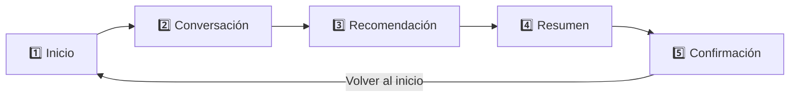

# OrderBot 🍔🤖

> ¡Pide fácil, recibe rápido!

Aplicación Android de ejemplo que simula un **asistente de pedidos de comida (chatbot)**
en un flujo de 5 pantallas, construida 100% con **Kotlin** y **Jetpack Compose**.


---

## 📱 Descripción

OrderBot guía al usuario desde la bienvenida hasta la confirmación de su pedido,
pasando por una conversación con el bot, una recomendación de complementos
(venta cruzada) y el resumen con el cálculo del total.



| Pantalla | Qué hace el usuario |
|---|---|
| **Inicio** | Ve la marca, el eslogan y los beneficios del servicio. |
| **Conversación** | El bot saluda y el usuario elige un producto del catálogo. |
| **Recomendación** | El bot ofrece agregar papas 🍟 y bebida 🥤 al pedido. |
| **Resumen** | Se muestran los productos, subtotal, envío y total. |
| **Confirmación** | Número de pedido, entrega estimada y estado. |

## ✨ Características

- 🎨 UI declarativa con **Jetpack Compose** y **Material 3**.
- 🌗 Tema claro y **oscuro** con paleta de marca propia (`OrderBotTheme`).
- 🧭 Navegación entre pantallas con `enum` type-safe (sin números mágicos).
- 💾 Estado que **sobrevive a rotaciones** y muerte del proceso (`rememberSaveable`).
- 💰 Precios centralizados en un catálogo: **una sola fuente de verdad**.
- 🧮 Lógica de negocio (subtotal/total) **separada de la UI** y con pruebas unitarias.
- 🌎 Textos en `strings.xml`, listos para traducir; precios formateados con `NumberFormat` (es-CO).
- 🖼️ Ícono de launcher adaptativo (incluye variante **monochrome** para íconos temáticos de Android 13+).
- 👁️ Previews de cada pantalla para iterar rápido en Android Studio.

## 🛠️ Tecnologías

| Área | Tecnología |
|---|---|
| Lenguaje | Kotlin 2.2.10 |
| UI | Jetpack Compose (BOM 2026.02.01) + Material 3 |
| Build | Gradle 9.5 · AGP 9.3.2 · Kotlin DSL |
| Compatibilidad | minSdk 24 · targetSdk 37 |
| Pruebas | JUnit 4 (pruebas unitarias locales) |

## 📂 Estructura del proyecto

```
app/src/main/java/com/example/myapplication/
├── MainActivity.kt              # Activity + navegación del flujo (estado raíz)
├── navigation/
│   └── Pantalla.kt              # Enum de pantallas (navegación type-safe)
├── model/
│   ├── Producto.kt              # Data class Producto + Catalogo (precios únicos)
│   └── ResumenPedido.kt         # Lógica de negocio: subtotal y total
├── util/
│   └── FormatoPrecio.kt         # Int.aPrecio(): 29000 -> "$29.000" (es-CO)
└── ui/
    ├── components/              # Componentes reutilizables
    │   ├── Botones.kt           #   BotonPrimario / BotonSecundario
    │   ├── OrderBotCard.kt      #   Tarjeta base con estilo unificado
    │   ├── TarjetaBeneficio.kt
    │   ├── TarjetaProducto.kt   #   Con API de "slots" para la acción
    │   └── FilaPrecio.kt
    ├── screens/                 # Un archivo por pantalla
    │   ├── PantallaInicio.kt
    │   ├── PantallaConversacion.kt
    │   ├── PantallaRecomendacion.kt
    │   ├── PantallaResumen.kt
    │   └── PantallaConfirmacion.kt
    └── theme/                   # Paleta de marca, tema claro/oscuro, tipografía
```

**Decisiones de diseño relevantes**

- **Catálogo como fuente única de verdad:** cada precio se define una sola vez en
  `Catalogo`; la pantalla de resumen se genera con un `forEach`, así que agregar
  un producto nuevo no requiere tocar la UI.
- **API de slots en `TarjetaProducto`:** quien la usa decide qué va al final de la
  fila (un botón *Elegir*, nada para un producto "próximamente", etc.), evitando
  duplicar layouts.
- **Composición sobre configuración:** `BotonPrimario`, `BotonSecundario` y
  `OrderBotCard` centralizan el estilo visual repetido en las 5 pantallas.

## 🚀 Cómo ejecutar

**Requisitos**

- [Android Studio](https://developer.android.com/studio) (versión reciente)
- JDK 17+ (el que incluye Android Studio funciona)
- Un emulador o dispositivo con Android 7.0 (API 24) o superior

**Pasos**

1. Clona el repositorio:
   ```bash
   git clone https://github.com/Juan77linux/5pantallas.git
   ```
2. Abre la carpeta del proyecto en Android Studio y espera el *sync* de Gradle.
3. Presiona **Run ▶** (`Shift + F10`) eligiendo un emulador o dispositivo.

**Desde la línea de comandos**

```bash
# Compilar el APK de depuración (queda en app/build/outputs/apk/debug/)
./gradlew :app:assembleDebug

# Ejecutar las pruebas unitarias
./gradlew :app:testDebugUnitTest
```

## 📄 Licencia

Este proyecto es un ejercicio educativo. Puedes usarlo libremente como referencia.

---

<p align="center">Hecho con 💙 y Kotlin</p>
